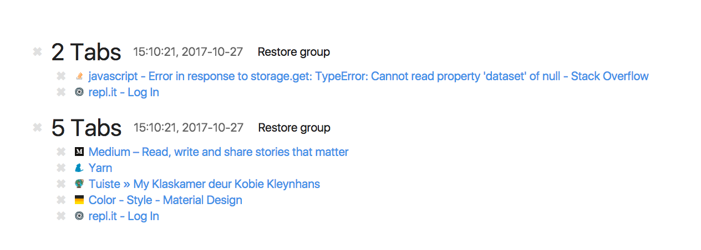

    

<h1 align="center">Tabby McTabface</h1>

  <strong>Nifty Tab Manager</strong>

  
  <a href="https://github.com/prettier/prettier">
    
     
  </a>
  
  

 

  
  
  

 

  Built with ❤︎ by <a href="https://github.com/tiaanduplessis">tiaanduplessis</a> and <a href="https://github.com/tiaanduplessis/tabby-mctabface/contributors">contributors</a>

<h2>Table of Contents</h2>

  
Table of Contents

  <li><a href="#about">About</a></li>
  <li><a href="#contribute">Contribute</a></li>
  <li><a href="#license">License</a></li>

## About

A actively maitained fork of [Tabulator](https://github.com/greduan/chrome-ext-tabulator).

    

## Contributing

Contributions are welcome!

1. Fork it.
2. Create your feature branch: `git checkout -b my-new-feature`
3. Commit your changes: `git commit -am 'Add some feature'`
4. Push to the branch: `git push origin my-new-feature`
5. Submit a pull request :D

Or open up [a issue](https://github.com/tiaanduplessis/react-native-view-finder/issues).

## License

Licensed under the MIT License.